# SFARL
# [Simultaneous Fidelity and Regularization Learning for Image Restoration](https://arxiv.org/pdf/1804.04522.pdf)

# Code

- [demos] `demo_derain.m`,`demo_deblur.m`,`demo_denoise.m`

- [models] include trained models for rain streak removal, image deconvolution and Gaussian denoising. 

- [matlab] include codes for SFARL inference and required MatconvNet files. 

- [datasets] include test images for each task.

- [results] include restored results for each task.

- [training] include training codes that will come soon.

# Motivation

Most existing non-blind restoration methods are based on the assumption that a precise degradation model is known. 
As the degradation process can only partially known or inaccurately modeled, images may not be well restored. 
We in this paper propose to design a flexible fidelity term to model the residual image caused by partially known degradation.
Regularization term can be simultaneously learned, resulting in SFARL model. 
SFARL is applied on image deconvolution, rain streak removal and Gaussian denoising.  
    
    
# Results

## Rain streak removal

The left is the rainy image, the right is the deraining image by SFARL.

 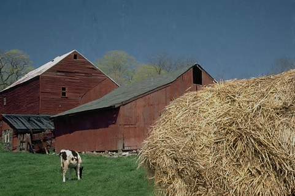

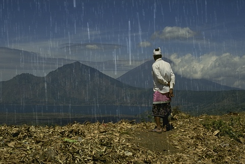 

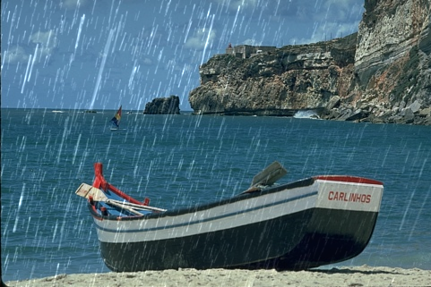 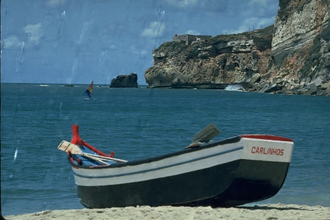

## Image deconvolution
The left is the degraded image by disk kernel, saturation, Gaussian noise and JPEG compression, the right is the deblurring image by SFARL.

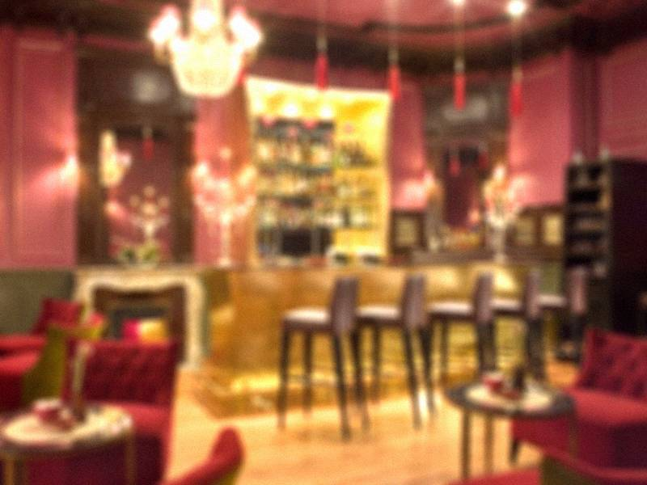 

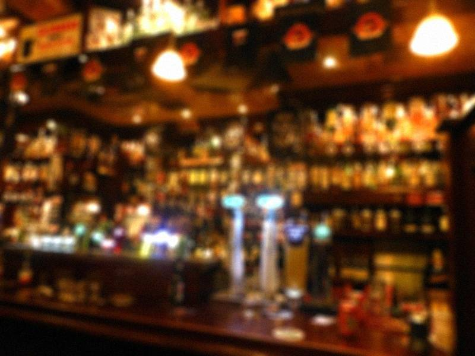 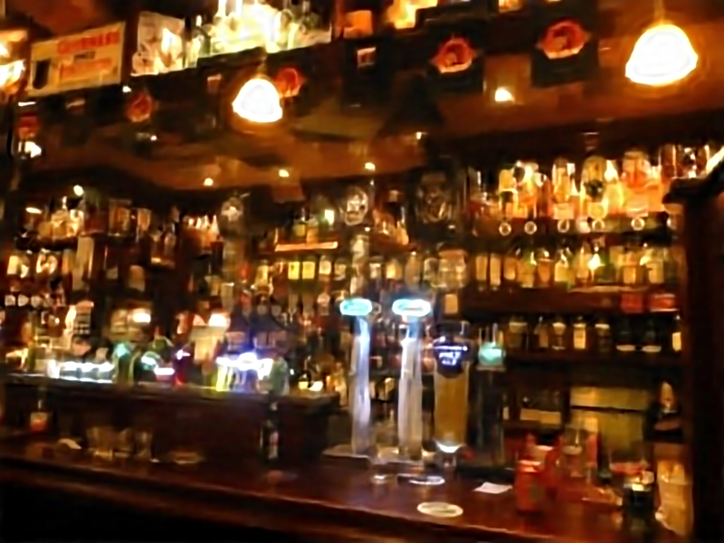

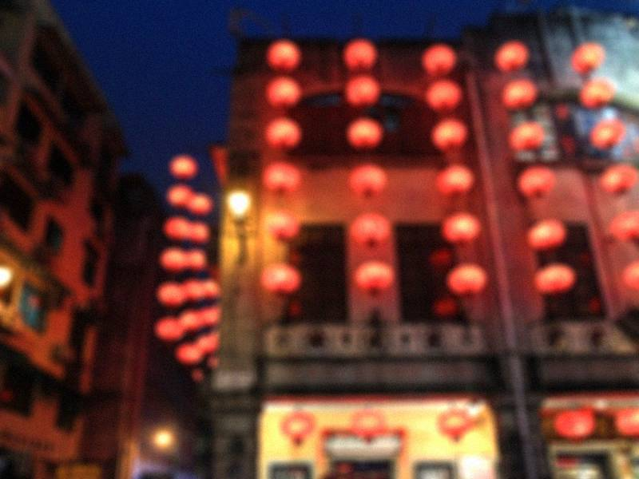 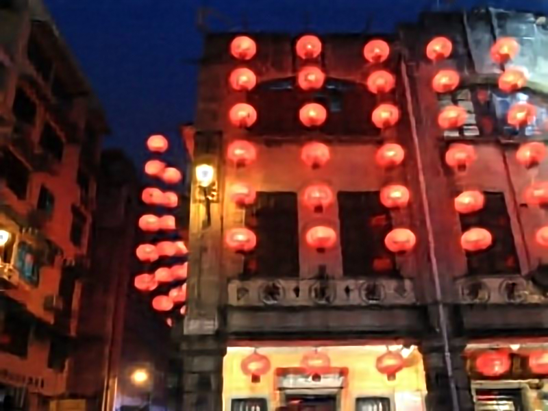

## Gaussian denoising

The left is the noisy image with Gaussian noise, the right is the denoising image by SFARL.

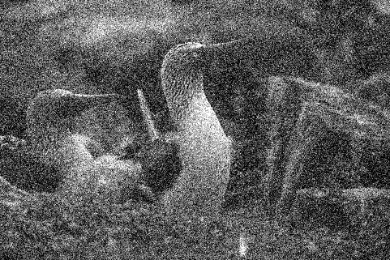 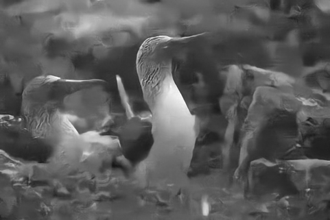

 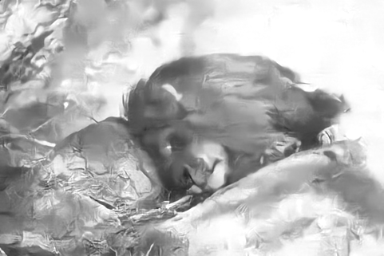

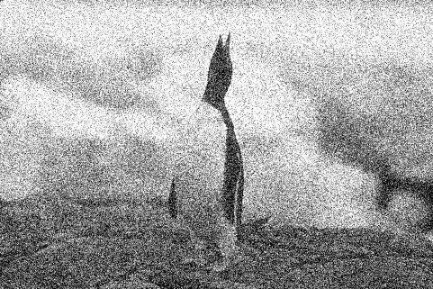 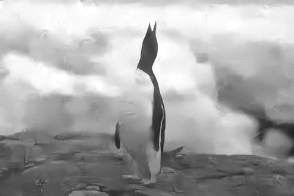

# Requirements and Dependencies
- Compiled mex files on Win(64bit), Linux(64bit) and Mac(64bit) are provided.
- Demos can be ran with CPU or GPU. 
  * MATLAB R2017a
  * [cuda](https://developer.nvidia.com/cuda-toolkit-archive)-8.0 & [cuDNN](https://developer.nvidia.com/cudnn) v-5.1

# Acknowledgments
Our implementation benefits from [TNRD]() and [UNET]() 

